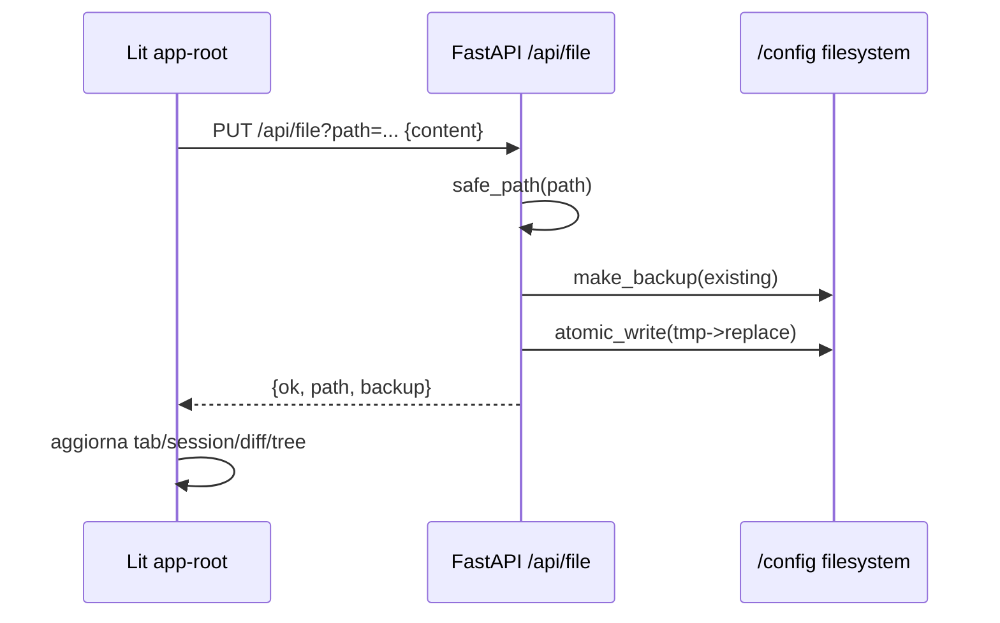

# File Editor Plus Audit Tecnico
Data audit: 2026-02-09  
Commit analizzato: `835a9fd`

## 1. Executive summary
File Editor Plus e' un add-on Home Assistant con Ingress abilitato, backend FastAPI e frontend Lit buildato con Vite (`file_editor_plus/config.yaml:17`, `file_editor_plus/backend/app.py:91`, `file_editor_plus/frontend/package.json:6`).  
Il runtime e' Uvicorn su porta 8099 gestito da s6 (`file_editor_plus/rootfs/etc/services.d/web/run:4`).  
Il container monta `/config` in RW e opera su file reali dell'istanza HA (`file_editor_plus/config.yaml:25`).  
La toolchain frontend e' chiara: `npm ci && npm run build` produce `frontend/dist`, poi Docker multi-stage copia in `/app/frontend` (`file_editor_plus/Dockerfile:7`, `file_editor_plus/Dockerfile:9`, `file_editor_plus/Dockerfile:26`).  
La gestione path ha guardrail solidi contro traversal (`safe_path`) e usa write atomica + backup (`file_editor_plus/backend/app.py:102`, `file_editor_plus/backend/app.py:153`, `file_editor_plus/backend/app.py:133`).  
Rischi principali: privilegi molto alti (`hassio_role: admin`), assenza di middleware HTTP hardening (CSP/security headers/CORS policy esplicita), e nessuna auth applicativa oltre a Ingress (`file_editor_plus/config.yaml:15`, `file_editor_plus/backend/app.py:91`).  
La build frontend e' stata eseguita con successo via container Node (`node:20-alpine`): Vite build OK in 2.54s, output `dist/` ~4.0M.  
La qualita' test backend e' discreta (13 test), ma 1 test fallisce (`test_traversal_blocked`) per mismatch tra aspettativa test e comportamento API (`file_editor_plus/backend/test_search_replace.py:81`).  
Il progetto e' funzionale e pratico per uso power-user, ma va rafforzato su least-privilege, hardening HTTP e CI quality gates.

## 2. Architettura (backend/frontend/ingress)

### 2.1 Backend
- Runtime: FastAPI + Uvicorn (`file_editor_plus/backend/requirements.txt:1`, `file_editor_plus/backend/requirements.txt:2`, `file_editor_plus/rootfs/etc/services.d/web/run:4`).
- Root dati: `/config`; store interno in `/config/.fep-config`; backup in `/config/.fep-backups` (`file_editor_plus/backend/app.py:30`, `file_editor_plus/backend/app.py:31`, `file_editor_plus/backend/app.py:33`).
- Endpoint principali:
- FS: `/api/tree`, `/api/file`, `/api/upload`, `/api/fs/move`, `/api/fs/copy`, `/api/fs/delete`, `/api/fs/download`, `/api/backup` (`file_editor_plus/backend/app.py:1296`, `file_editor_plus/backend/app.py:1336`, `file_editor_plus/backend/app.py:1393`, `file_editor_plus/backend/app.py:1514`, `file_editor_plus/backend/app.py:1200`, `file_editor_plus/backend/app.py:1269`, `file_editor_plus/backend/app.py:1375`, `file_editor_plus/backend/app.py:1174`).
- Utility/config: snippets, user-config, session, debug-log (`file_editor_plus/backend/app.py:1593`, `file_editor_plus/backend/app.py:1666`, `file_editor_plus/backend/app.py:1731`, `file_editor_plus/backend/app.py:1044`).
- HA proxy: `/api/ha/states`, `/api/ha/ws`, `/api/ha/action` via `SUPERVISOR_TOKEN` (`file_editor_plus/backend/app.py:874`, `file_editor_plus/backend/app.py:897`, `file_editor_plus/backend/app.py:957`, `file_editor_plus/backend/app.py:42`).
- Guardrail path: `safe_path` blocca assoluti, `..`, null byte, e uscita da base (`file_editor_plus/backend/app.py:102-130`).

### 2.2 Frontend
- Stack: Lit + TypeScript + Vite (`file_editor_plus/frontend/package.json:10`, `file_editor_plus/frontend/package.json:18`, `file_editor_plus/frontend/vite.config.ts:1`).
- Entry: `src/main.ts` importa `app-root` (`file_editor_plus/frontend/src/main.ts:2`).
- Root component: `app-root` (gestione sidebar attivita', editor, split/compare, sessione, search, snippets, backup/system) (`file_editor_plus/frontend/src/app-root.ts:90`, `file_editor_plus/frontend/src/app-root.ts:2547`).
- API base ingress-aware: calcolata da `window.location.href` (`file_editor_plus/frontend/src/app-root.ts:94-97`).
- WS HA via proxy backend sul base path corrente (`file_editor_plus/frontend/src/ha-client.ts:32`, `file_editor_plus/frontend/src/ha-client.ts:37`).

### 2.3 Ingress
- Manifest add-on: `ingress: true`, `ingress_port: 8099`, `ingress_panel: true` (`file_editor_plus/config.yaml:17-19`).
- API permessi HA/Supervisor abilitati (`homeassistant_api: true`, `hassio_api: true`, `hassio_role: admin`) (`file_editor_plus/config.yaml:13-15`).
- Backend serve SPA + fallback routing (`file_editor_plus/backend/app.py:1864-1886`).
- Vite usa `base: "./"`, utile sotto path prefix ingress (`file_editor_plus/frontend/vite.config.ts:5`).

### 2.4 Diagramma componenti
```mermaid
flowchart LR
  U[Utente HA UI] --> I[HA Ingress /api/hassio_ingress/...]
  I --> A[Addon Container :8099]
  A --> B[FastAPI app.py]
  B --> F[/config (rw)/]
  B --> H[Supervisor/Core API + WS]
  B --> S[/app/frontend (dist)]
  S --> U
```

### 2.5 Diagramma data flow (salvataggio file)


## 3. Mappa file & responsabilita'

| Path | Ruolo |
|---|---|
| `repository.json` | Metadata repo add-on custom HA |
| `file_editor_plus/config.yaml` | Manifest add-on (ingress, API permissions, map /config) |
| `file_editor_plus/build.yaml` | Base image per architetture HA |
| `file_editor_plus/Dockerfile` | Build multi-stage frontend + runtime backend |
| `file_editor_plus/rootfs/etc/services.d/web/run` | Entrypoint s6 che avvia Uvicorn |
| `file_editor_plus/backend/app.py` | API backend, FS ops, HA proxy, sessione, SPA serving |
| `file_editor_plus/backend/requirements.txt` | Dipendenze Python pinned |
| `file_editor_plus/frontend/package.json` | Script/build deps frontend |
| `file_editor_plus/frontend/vite.config.ts` | Config build Vite (base, outDir, plugin/babel) |
| `file_editor_plus/frontend/src/app-root.ts` | Shell UI principale Lit |
| `file_editor_plus/frontend/src/services/api.ts` | Client API HTTP frontend |
| `file_editor_plus/frontend/src/ha-client.ts` | Client REST+WS per entita' HA via proxy backend |
| `file_editor_plus/backend/test_search_replace.py` | Unit test ricerca/replace backend |
| `.github/workflows/release.yml` | Workflow release manuale (no CI test/lint) |
| `AI/knowledge.yaml` | Memoria operativa con comandi build/redeploy |

## 4. Flussi principali (azioni utente -> chiamate -> filesystem)

### 4.1 Apertura tree
1. UI avvia `loadTree("")` in `connectedCallback` (`file_editor_plus/frontend/src/app-root.ts:615-619`).
2. Chiamata `GET /api/tree` (`file_editor_plus/frontend/src/features/tree/tree.ts:38`, `file_editor_plus/frontend/src/services/api.ts:5-7`).
3. Backend valida path e lista directory con filtro `DEFAULT_IGNORE` (`file_editor_plus/backend/app.py:1297-1333`, `file_editor_plus/backend/app.py:83-89`).

### 4.2 Lettura/salvataggio file
1. `openFile` -> `apiGetFile` (`file_editor_plus/frontend/src/app-root.ts:904-917`, `file_editor_plus/frontend/src/app-root.ts:957-966`).
2. Backend `GET /api/file` con `safe_path`, read UTF-8 replace (`file_editor_plus/backend/app.py:1336-1350`).
3. Save UI -> `PUT /api/file` (`file_editor_plus/frontend/src/app-root.ts:2518-2523`, `file_editor_plus/frontend/src/services/api.ts:15-21`).
4. Backend fa backup + atomic write (`file_editor_plus/backend/app.py:1505-1511`, `file_editor_plus/backend/app.py:133-163`).

### 4.3 Upload/move/delete
- Upload multipart a `/api/upload`, controllo nome, dimensione 50MB, mode fail/overwrite/autorename (`file_editor_plus/backend/app.py:1393-1477`).
- Move con blocco self-nesting e conflict mode (`file_editor_plus/backend/app.py:1514-1590`).
- Delete file/dir (`/api/fs/delete`) con backup solo file (`file_editor_plus/backend/app.py:1269-1293`).

### 4.4 Integrazione entita' HA realtime
- Frontend inizializza `HAClient` (`file_editor_plus/frontend/src/features/entities/entities.ts:238-253`).
- REST states: `GET /api/ha/states`; WS: `/api/ha/ws` (`file_editor_plus/frontend/src/ha-client.ts:37`, `file_editor_plus/frontend/src/ha-client.ts:32`).
- Backend proxy autenticato con `SUPERVISOR_TOKEN` verso `supervisor/core/api` e websocket core (`file_editor_plus/backend/app.py:874-894`, `file_editor_plus/backend/app.py:897-955`).

## 5. Build & Dev workflow (comandi esatti)

### 5.1 Toolchain frontend identificata
- Install deps: `npm ci` (`file_editor_plus/Dockerfile:7`, `file_editor_plus/frontend/package.json:6`).
- Build prod: `npm run build` (`file_editor_plus/frontend/package.json:6`).
- Output: `frontend/dist` (`file_editor_plus/frontend/vite.config.ts:20`).
- Integrazione immagine add-on: `COPY --from=fe /fe/dist /app/frontend` (`file_editor_plus/Dockerfile:26`).

### 5.2 Build frontend eseguita durante audit
Comando usato:
```bash
docker run --rm \
  -v /mnt/supervisor/addons/local/ha-file-editor-plus/file_editor_plus/frontend:/app \
  -w /app node:20-alpine sh -c 'npm ci && npm run build'
```
Esito:
- `npm ci`: OK, 81 pacchetti installati, 0 vulnerabilita' riportate.
- `vite build`: OK, `✓ built in 2.54s`.
- Artefatti generati in `file_editor_plus/frontend/dist` (8 file principali), size totale `4.0M`.
- Nota: primo run ha incluso pull immagine `node:20-alpine`, quindi tempo complessivo wall-clock maggiore.

### 5.3 Comandi rebuild/restart add-on (documentati nel repo)
Fonte: `AI/knowledge.yaml:97-100`.
```bash
# Build frontend via container Node
docker run --rm -v /mnt/supervisor/addons/local/ha-file-editor-plus/file_editor_plus/frontend:/app -w /app node:20-alpine sh -c "npm ci && npm run build"

# Rebuild + restart add-on in Home Assistant
 docker exec hassio_cli ha addons rebuild local_file_editor_plus
 docker exec hassio_cli ha addons restart local_file_editor_plus
```

### 5.4 Ricetta ripetibile (Modifica -> Build Lit -> Rebuild -> Restart -> Logs)
1. Modifica file frontend in `file_editor_plus/frontend/src/`.
2. Build Lit/Vite con comando docker sopra.
3. Rebuild add-on (`ha addons rebuild ...`).
4. Restart add-on (`ha addons restart ...`).
5. Logs:
- UI Supervisor: Add-on -> File Editor Plus -> Logs.
- CLI logs: **Non determinabile dal repo attuale** (nel repo non e' documentato un comando `ha addons logs`).

## 6. Punti forti
- Path safety centralizzata e consistente su endpoint FS (`file_editor_plus/backend/app.py:102-130`).
- Scrittura robusta: backup e atomic write (`file_editor_plus/backend/app.py:133-163`, `file_editor_plus/backend/app.py:1505-1511`).
- Buon set funzionale editor (search/replace multi-file, diff, upload, session restore) (`file_editor_plus/backend/app.py:850-872`, `file_editor_plus/backend/app.py:1847-1861`, `file_editor_plus/backend/app.py:1731-1835`).
- Ingress compatibility curata lato frontend (`apiBase` dinamico + Vite base relativo) (`file_editor_plus/frontend/src/app-root.ts:94-97`, `file_editor_plus/frontend/vite.config.ts:5`).
- Dipendenze backend pinned (`file_editor_plus/backend/requirements.txt:1-6`).
- Test backend presenti su aree critiche (diff, format, search/replace) (`file_editor_plus/backend/test_diff.py`, `file_editor_plus/backend/test_format_yaml.py`, `file_editor_plus/backend/test_search_replace.py`).

## 7. Punti deboli / rischi (con severita')

| Severita' | Rischio | Evidenza | Impatto pratico |
|---|---|---|---|
| High | Privilegi add-on elevati (`hassio_role: admin` + API Home Assistant/Supervisor) | `file_editor_plus/config.yaml:13-15` | Se compromesso l'addon, impatto esteso su host/core/supervisor. |
| High | Container non forzato a utente non-root | assenza `USER` in `file_editor_plus/Dockerfile` | Maggiore blast radius in caso di RCE/backend exploit. |
| Medium | Nessun hardening HTTP esplicito (CSP, security headers, CORS policy dedicata) | `file_editor_plus/backend/app.py` (assenza middleware/headers) | Dipendenza totale da sicurezza Ingress/proxy esterno. |
| Medium | Log diagnostici includono prefisso token (`token_prefix`) | `file_editor_plus/backend/app.py:880-881`, `file_editor_plus/backend/app.py:905-906`, `file_editor_plus/backend/app.py:968-973` | Possibile leakage parziale in log runtime/support bundle. |
| Medium | CI non valida test/lint/build su PR | `.github/workflows/release.yml` (solo release manuale) | Regressioni intercettate tardi. |
| Medium | Test suite backend ha 1 failing test reale durante audit | `file_editor_plus/backend/test_search_replace.py:81` + run audit | Copertura/aspettative incoerenti su traversal replace API. |
| Low | `rootfs/app/index.html` sembra artefatto legacy non usato | `file_editor_plus/rootfs/app/index.html:1-13` + serving da `/app/frontend` (`file_editor_plus/backend/app.py:1865-1875`) | Ambiguita' manutentiva. |
| Low | Nessun comando lint/typecheck ufficiale nel repo | `AI/knowledge.yaml:90-95` | Qualita' statica non standardizzata. |

## 8. Raccomandazioni (quick/medio/strutturali)

### 8.1 Quick wins (1-2h)

| Intervento | Motivazione | File/area | Rischio | Come testare |
|---|---|---|---|---|
| Rimuovere `token_prefix` dai log info/warn | Ridurre leakage credenziali | `file_editor_plus/backend/app.py` | Low | Chiamare `/api/ha/states` e verificare log senza prefissi token. |
| Aggiungere header di sicurezza minimi (`X-Content-Type-Options`, `Referrer-Policy`, CSP base) | Hardening immediate | `file_editor_plus/backend/app.py` (middleware) | Medium | `curl -I` su `/` e `/api/health`, verificare headers presenti. |
| Documentare ufficialmente comando logs in `README` | Dev loop incompleto nel repo | `file_editor_plus/README.md` | Low | Seguire ricetta completa da zero in ambiente HA. |

### 8.2 Medio (1-2gg)

| Intervento | Motivazione | File/area | Rischio | Come testare |
|---|---|---|---|---|
| Correggere `test_traversal_blocked` (attualmente aspettativa errata) e allineare semantica errore | Stabilita' quality gate | `file_editor_plus/backend/test_search_replace.py` + `app.py` | Medium | `python -m unittest` deve passare 100%. |
| Introdurre workflow CI su PR (build frontend + test backend) | Prevenire regressioni | `.github/workflows/` | Medium | PR di prova con commit che rompe build deve fallire in CI. |
| Validare e restringere meglio endpoint ad alto impatto (`/api/ha/action`) con allowlist minima runtime | Riduzione rischio operativo | `file_editor_plus/backend/app.py:74-80`, `957-999` | High | Test manuale su azioni consentite/non consentite + status codes. |

### 8.3 Strutturali (1-2 settimane)

| Intervento | Motivazione | File/area | Rischio | Come testare |
|---|---|---|---|---|
| Ridurre privilegi add-on (role/API) e verificare minimo necessario | Least privilege reale | `file_editor_plus/config.yaml` | High | Matrice test funzionale con permessi graduali e regressioni su Entities/System. |
| Eseguire runtime non-root + hardening container filesystem | Defense-in-depth | `file_editor_plus/Dockerfile`, manifest add-on | High | Test upload/save/backup + smoke test completo su arch supportate. |
| Separare API "dangerous" (azioni host/core) da editor file (flag configurabile) | Ridurre superficie d'attacco | backend + frontend system pane | Medium | E2E con feature flag on/off, controllo route availability. |

## 9. Piano test (manuale + automatizzabile)

### 9.1 Manuale
1. Ingress load sotto path token HA: aprire add-on da panel e verificare static + API (`/api/health`).
2. CRUD file: create/read/update/delete su file in `/config`, verifica backup in `.fep-backups`.
3. Upload conflitti: fail/overwrite/autorename.
4. Move/copy/delete su file e cartelle annidate (incluso blocco self-nesting).
5. Session restore: aprire piu' tab, dirty buffer, refresh, validare restore.
6. Entities: states iniziali + update realtime via WS.
7. Security smoke: tentativi `../` e path assoluti su endpoint FS -> 400/403.

### 9.2 Automatizzabile
- Backend unit tests: `test_diff.py`, `test_format_yaml.py`, `test_search_replace.py`.
- Frontend build gate: `npm ci && npm run build` in container Node.
- API regression suite (consigliata): smoke endpoints FS + HA proxy mockato.
- CI proposta: trigger su PR con matrix minima (python test + frontend build).

## 10. Checklist Definition of Done (PR future)
- [ ] Frontend build production OK (`npm ci && npm run build` o equivalente containerizzato).
- [ ] Backend test suite tutta verde.
- [ ] Nessun nuovo endpoint senza `safe_path`/validazioni input.
- [ ] Nessun log con token/segreti anche parziali.
- [ ] Verifica funzionale ingress path prefix (`/api/hassio_ingress/...`).
- [ ] Rebuild/restart add-on testato almeno su un ambiente HA reale.
- [ ] Changelog/versione allineati (`config.yaml` + `app-root.ts`) come da workflow release (`.github/workflows/release.yml:43-55`).

## 11. Unknowns / Assunzioni
- Policy headers/riscritture precise del proxy Ingress Home Assistant: **Non determinabile dal repo attuale** (servirebbe config runtime Supervisor/Ingress effettiva).
- Healthcheck/watchdog orchestrato da Supervisor oltre al processo Uvicorn: **Non determinabile dal repo attuale** (servirebbe metadata Supervisor runtime e stato add-on in HA).
- Comando CLI ufficiale per logs add-on nel flusso locale: **Non determinabile dal repo attuale** (nel repo sono documentati solo rebuild/restart in `AI/knowledge.yaml:99-100`).

## Appendice A - Evidenze esecuzione audit
- Build frontend eseguita via container Node `20-alpine`: successo.
- Test backend eseguiti via container Python `3.12-alpine`: 13 run, 12 ok, 1 fail (`test_traversal_blocked`).
- Modifiche codice progetto: nessuna.
- Artefatti creati dall'audit:
  - `file_editor_plus/frontend/dist/*` (build output).
  - `file_editor_plus/backend/.venv/` e `file_editor_plus/backend/__pycache__/` creati dal container test, root-owned (non rimovibili in questo contesto senza privilegi elevati).
